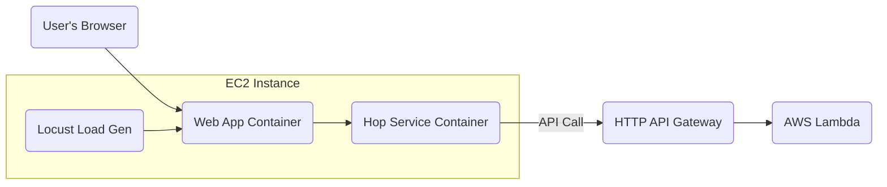

Full-Stack AWS Demo for APM
===========================

This project provides a deployable, multi-tier web application designed to demonstrate Application Performance Monitoring (APM) and distributed tracing across a distributed system on AWS. It consists of a multi-container Python Flask frontend running on EC2, which communicates with a Python backend running on AWS Lambda via an API Gateway. A Locust app runs locally on the EC2 host as a container with a predefined load generation policy.
-   The Lambda is instrumented with the [New Relic Lambda Layer](https://docs.newrelic.com/docs/serverless-function-monitoring/aws-lambda-monitoring/instrument-lambda-function/configure-serverless-aws-monitoring/ "null") provided as a private zip file.
    -   *This method is useful for custom layer versions or in environments where direct access to public AWS layers is restricted.*

The entire infrastructure is defined as code using AWS CloudFormation for easy, repeatable, and automated deployments.

Demo Touchpoints
----------------

The app stack supports the following touchpoints for a New Relic demo:
  - APM<>Lambda Convergence
  - Distributed Tracing
  - Errors Inbox
    - Multiple error groups with user impact tracked
  - Service Map
  - Transaction 360

_Not an all-inclusive list, multiple other capabilities are present, but these are the ones the demo was specifically built for._

Final Architecture
------------------

In New Relic, you'll see the following 3 entities in APM:
  - `$PROJECT_NAME-hop-service`
  - `$PROJECT_NAME-lambda-function`
  - `$PROJECT_NAME-webapp`



Project Structure
-----------------

This is the required folder and file structure for the deployment script to work correctly.

```
.
├── app/                      # The user-facing Flask web application
│   ├── static/
│   │   └── script.js
│   ├── templates/
│   │   └── index.html
│   ├── Dockerfile
│   ├── main.py
│   └── requirements.txt
├── hop-service/              # The intermediate Flask "hop" service
│   ├── Dockerfile
│   ├── main.py
│   └── requirements.txt
├── lambda/                   # The AWS Lambda handler code with manually downloaded New Relic layer
│   ├── app.py
│   └── newrelic-layer.zip
├── locust/                   # The Locust app for load generation
│   ├── locustfile.py
├── cloudformation.yaml       # CloudFormation template for all AWS resources
├── deploy.sh                 # Script to automate the entire deployment
├── docker-compose.yml        # Defines the multi-container setup for EC2
└── README.md
```

Deployment Walkthrough
----------------------

Follow these steps precisely to deploy the application from your local machine to your AWS account.

### Step 1: Prerequisites
1.  **AWS Account & CLI**: You must have an AWS account and the [AWS CLI installed and configured](https://docs.aws.amazon.com/cli/latest/userguide/cli-chap-configure.html "null").
    -   **IAM Permissions**: The user or role running the deployment script needs permissions to create the resources defined in `cloudformation.yaml`. Using an `AdministratorAccess` policy is the simplest approach for a demo.
    -   **Verification**: Verify your CLI configuration by running `aws sts get-caller-identity`. This should return your account details without errors.
2.  **S3 Bucket**: Create an S3 bucket in your desired AWS region. This bucket will be used to store deployment artifacts for the Lambda function and layer.
3.  **EC2 Key Pair**: Create an [EC2 Key Pair](https://docs.aws.amazon.com/AWSEC2/latest/UserGuide/ec2-key-pairs.html "null") in the same region. You will need the key pair's name for the deployment script and the corresponding `.pem` file to access the EC2 instance.
4.  **New Relic Lambda Layer (Optional)**: Only if you change the Python version of the Lambda code, download the New Relic Python Lambda Layer zip file. Rename it to `newrelic-layer.zip` and place it inside the `lambda/` directory of this project.
5.  **Local Tools**: Ensure you have `git` and `dig` installed. `dig` is often available via packages like `dnsutils` or `bind-utils`.

### Step 2: Deploy the AWS Infrastructure

This script will provision all the necessary AWS resources, including the Lambda, API Gateway, and the EC2 Instance.
1.  **Make the script executable**:
    ```sh
    chmod +x deploy.sh
    ```
2.  **Execute the deployment script**: Run the script from your terminal, providing the following named arguments:
    -   `--project-name`: A short, unique prefix for all created AWS resources.
    -   `--bucket`: The name of your S3 bucket (**just the name, not the full `s3://` URI**).
    -   `--stack`: A unique name for this CloudFormation deployment.
    -   `--key-pair`: The name of your EC2 key pair.
    -   `--nr-license-key`: The ingest license key for your New Relic account.
    -   `--nr-account-id`: The ID for your target New Relic account.

    > _**Choosing a `project-name`:** This value is used as a prefix. For example, if you provide `MyWebApp`, the script will create resources named `MyWebApp-Lambda`, `MyWebApp-EC2Instance`, etc. Choose a concise name and avoid including terms like "Lambda" or "EC2" in it, as the template already adds those suffixes._
    ```sh
    # example using vars
    export PROJECT_NAME=""
    export S3_BUCKET=""
    export STACK_NAME=""
    export KEY_PAIR_NAME=""
    export NEW_RELIC_LICENSE_KEY=""
    export NEW_RELIC_ACCOUNT_ID=""
    echo -e "\nPROJECT: $PROJECT_NAME\n\tBUCKET: $S3_BUCKET\n\tSTACK: $STACK_NAME\n\tKEYPAIR: $KEY_PAIR_NAME\n\tNR LICENSE: $NEW_RELIC_LICENSE_KEY\n\tNR ACCOUNT: $NEW_RELIC_ACCOUNT_ID"
    ```

    ```sh
    ./deploy.sh \
      --project-name $PROJECT_NAME \
      --bucket $S3_BUCKET \
      --stack $STACK_NAME \
      --key-pair $KEY_PAIR_NAME \
      --nr-license-key $NEW_RELIC_LICENSE_KEY \
      --nr-account-id $NEW_RELIC_ACCOUNT_ID
    ```
    The script will automatically detect your public IP to secure SSH access and will wait for the entire CloudFormation stack to be deployed.
3.  **Collect the Outputs**: When the script completes, it will display a table of outputs. **Copy the `ApiGatewayEndpoint` and the `EC2PublicIp` values**, as you will need them in the next step.

### Step 3: Configure and Run Frontend Services on EC2

Now, you will connect to the newly created EC2 instance to set up and run the frontend containers.
1.  **SSH into the EC2 Instance**: Use the `.pem` file for your key pair and the `EC2PublicIp` from the script's output. The username for the Ubuntu instance is `ubuntu`.
    ```sh
    ssh -i /path/to/your-key.pem ubuntu@<EC2PublicIp>
    ```

2.  **Clone the Project Directory on the EC2 Instance**: Once connected via SSH, you need to get the project files. Since this project lives in a subdirectory of a larger repository, using `git sparse-checkout` is the most efficient way to download only the necessary files.

    ```sh
    # Clone the repository structure without downloading all the files
    git clone --filter=blob:none --no-checkout https://github.com/newrelic/demo-apps.git
    cd demo-apps

    # Configure git to only pull the specific project directory
    git sparse-checkout init --cone
    git sparse-checkout set apm-lambda-convergence

    # Finally, pull down the files for only that directory
    # Change <main> here if you're using a feature branch
    git checkout main

    # Navigate into the project directory
    cd apm-lambda-convergence
    ```
    This process ensures that only the `apm-lambda-convergence` directory is downloaded to the EC2 instance, saving time and disk space.

3.  **Configure the Variables**: You need to tell the services the, project name, URL of the deployed backend, and New Relic license key. Set them as environment variables in your SSH session. This method is cleaner than editing files manually.

    ```sh
    export PROJECT_NAME=""
    export API_GATEWAY_URL=""
    export NEW_RELIC_LICENSE_KEY=""
    echo -e "\nPROJECT: $PROJECT_NAME\n\tAPI GATEWAY: $API_GATEWAY_URL\n\tLICENSE KEY: $NEW_RELIC_LICENSE_KEY"
    ```

4.  **Run the Docker Containers**: With the environment variables configured, start the services using Docker Compose. The `ubuntu` user has been added to the `docker` group, so `sudo` is not required.
    ```sh
    docker-compose up --build -d
    ```

5. **(Optional) View the Container Logs**: When the containers are running, you can watch all of their logs at once using Docker Compose.
    ```sh
    docker compose logs --follow
    ```

### Step 4: Access and Use the Application

The application is now fully deployed and running in the cloud.
1.  **Access the Web UI**: Open your local web browser and navigate to the public IP of your EC2 instance on port 8000: `http://<EC2PublicIp>:8000`
2.  **Use the UI**:
    -   Click **"Invoke Success"** or **"Invoke Error"** to send single requests through the entire stack.
    -   Observe the response from the Lambda function displayed on the page.
3.  **Access Locust UI**: Locust will automatically start load gen, but you can also navigate to the UI if you need to do something like a stress test.
    -   Open a new tab and navigate to the public IP on port 8089: `http://<EC2PublicIp>:8089`
    -   The containers run with 4 workers, running a higher number of users in Locust will create a queue that should result in increased latency, a throughput plateau, and potential timeouts.

Tearing Down the Stack
----------------------

To avoid ongoing AWS charges, you must delete all the created resources.
1.  **Delete the CloudFormation Stack**: This is the primary cleanup step and will remove all resources created by the template (EC2 instance, Lambda, API Gateway, IAM roles, etc.). Replace `YOUR_STACK_NAME` with the name you provided during deployment.
    ```sh
    aws cloudformation delete-stack --stack-name YOUR_STACK_NAME
    ```
