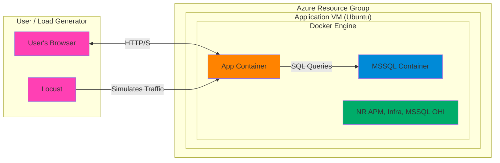

MSSQL Application Stack on Azure (Container Edition)
====================================================
This project deploys a complete, observable web application and database environment into Microsoft Azure. The purpose is to create a realistic, cost-effective environment for demonstrating full-stack observability with New Relic.

The stack runs on a single Azure Virtual Machine. It consists of:

1.  **Docker Containers:**
    -   A **Python Flask application** serving the web UI and query endpoints.
    -   A **Microsoft SQL Server 2022** container that automatically restores the AdventureWorks database.
2.  **VM Services:**
    -   The **New Relic Infrastructure agent** installed as a service on the host VM, providing host and container monitoring.

The Flask application is instrumented with the New Relic APM agent, providing a complete, observable stack from the front end to the database, all running on one VM.

Architecture
------------
The diagram below illustrates the components of this containerized application stack. The entire environment runs within a single Azure VM.

Code snippet



Directory Structure
-------------------
The project is organized into the following directories and files:

```
.
├── README.md                 # This file
├── docker-compose.yml        # Docker Compose orchestration file
├── run_stored_procedures.sh  # Script to manually apply DB procedures
├── terraform/                # Terraform configuration files
│   ├── main.tf
│   ├── variables.tf
│   ├── outputs.tf
│   └── terraform.tfvars.example
├── app/                      # Source files for VM setup and App container
│   ├── setup.sh              # Main cloud-init script for the VM
│   ├── Dockerfile
│   ├── requirements.txt
│   ├── app.py
│   ├── locustfile.py
│   └── templates/
│       └── index.html
│       └── logo.svg
└── mssql/                    # MSSQL container setup files
    ├── Dockerfile
    ├── setup_sql.sh
    └── stored_procedures.sql
```

Prerequisites
-------------
1.  **Azure Account:** An active Azure subscription.
2.  **Azure CLI:** Installed and authenticated (`az login`).
3.  **Terraform:** Installed on your local machine.
4.  **New Relic Account:**
    -   A New Relic Ingest License Key.

Deployment Steps
----------------

### Step 1: Configure Deployment Variables
1.  Navigate to the `terraform` directory.
2.  Create a `terraform.tfvars` file by copying the example:
    ```
    cp terraform.tfvars.example terraform.tfvars
    ```
3.  Edit `terraform.tfvars` and provide values for all the required variables:
    -   `project_prefix`
    -   `admin_password` (for the VM)
    -   `mssql_sa_password` (for the database container)
    -   `my_ip_address`
    -   `new_relic_license_key`
    -   `new_relic_team_tag`
    -   `new_relic_environment_tag`

### Step 2: Deploy the Infrastructure
From within the `terraform` directory, initialize and apply the Terraform configuration:

```
# Navigate to the terraform directory
cd terraform

# Initialize Terraform
terraform init

# Plan the deployment
terraform plan

# Apply the configuration to create the resources in Azure
terraform apply
```

Terraform will provision the VM, and the `cloud-init` process will automatically install Docker and run `docker compose` to build and start the application.

### Step 3: Apply Custom Stored Procedures
After the VM is deployed, you must manually run a script on the host to add the custom stored procedures to the database and setup for the MSSQL OHI Query Performance monitoring.

1.  **SSH into the VM.** Use the `public_ip_address` from the Terraform output and the `admin_password` from your `terraform.tfvars` file.

    ```
    ssh ubuntu@<public_ip_address>
    ```

2.  **Wait for setup to finish.** The cloud-init script for the VM will take several minutes to complete. Once the containers are all healthy you can move to the next step.

    ```
    tail -f /var/log/startup-script.log
    ```

3.  **Run the script.** The script is located in the `/opt/adventureworks` directory. You must pass it the SQL password you defined in `terraform.tfvars`. . 

    ```
    MSSQL_SA_PASSWORD=PASSWORD_GOES_HERE /opt/adventureworks/run_stored_procedures.sh
    ```

The script will execute and then run a verification query to confirm the procedures were created.

### Step 4: Access the Application

You can now access the application and Locust UI in your browser.

Troubleshooting
---------------

### Ubuntu Host
- SSH to the Ubuntu host from your terminal: `ssh ubuntu@<public_ip_address>`

  - You'll be prompted for the `admin_password` you've stored in `terraform.tfvars`

- If you've run a `terraform apply` to rebuild the VM using the same public IP, you need to clear the old host ids to connect to the new host using `ssh-keygen -R <public_ip_address>`.

    Example error:

        ```
        azure-mssql/terraform > ssh ubuntu@192.168.0.1
        @@@@@@@@@@@@@@@@@@@@@@@@@@@@@@@@@@@@@@@@@@@@@@@@@@@@@@@@@@@
        @    WARNING: REMOTE HOST IDENTIFICATION HAS CHANGED!     @
        @@@@@@@@@@@@@@@@@@@@@@@@@@@@@@@@@@@@@@@@@@@@@@@@@@@@@@@@@@@
        IT IS POSSIBLE THAT SOMEONE IS DOING SOMETHING NASTY!
        Someone could be eavesdropping on you right now         (man-in-the-middle attack)!
        It is also possible that a host key has just been changed.
        The fingerprint for the ED25519 key sent by the remote host is
        SHA256:kLul74waOhWUhh/TRDJBXZfZCXRxgaWS9okegNK75DQ.
        Please contact your system administrator.
        Add correct host key in .ssh/known_hosts to get rid of this         message.
        Offending ECDSA key in .ssh/known_hosts:251
        Host key for 192.168.0.1 has changed and you have requested         strict checking.
        Host key verification failed.
        ```

- You can follow the setup script log here: `tail -f /var/log/startup-script.log`

- The SQL setup script log will be here: `tail -f /usr/src/app/setup-sql.log`

- Check the ongoing status of the Docker Compose build with `watch docker ps -a`

- And the logs of an individual container with `docker logs <container_id> --follow`

Using the Application
---------------------

### Web UI

Navigate to the public IP address in your web browser: `http://<public_ip_address>:5000`

The UI will present several buttons, each triggering a different type of SQL query against the AdventureWorks database.

### Load Generation with Locust

Navigate to the Locust UI in your browser: `http://<public_ip_address>:8089`

1.  Enter the number of users to simulate (e.g., 10).

2.  Enter a spawn rate (e.g., 1 user per second).

3.  For the host, enter the web application's URL: `http://<public_ip_address>:5000`

4.  Click "Start swarming" to begin the load test.

*Note: The Locust load test is designed to target the stateless query endpoints (/query/normal, /query/wait, etc.) to generate consistent, observable load.*

You can now observe the incoming data in your New Relic account.

Destroying the Environment
--------------------------

To avoid ongoing Azure costs, destroy the infrastructure when you are finished.

From within the `terraform` directory:

```
terraform destroy
```
